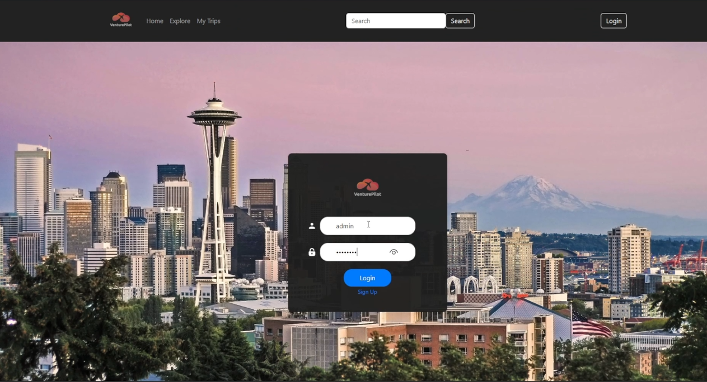
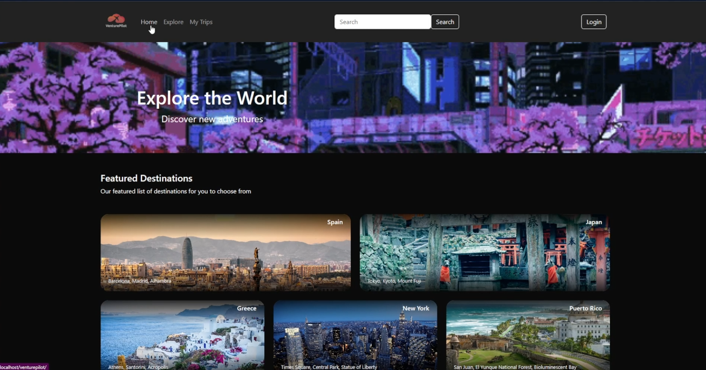
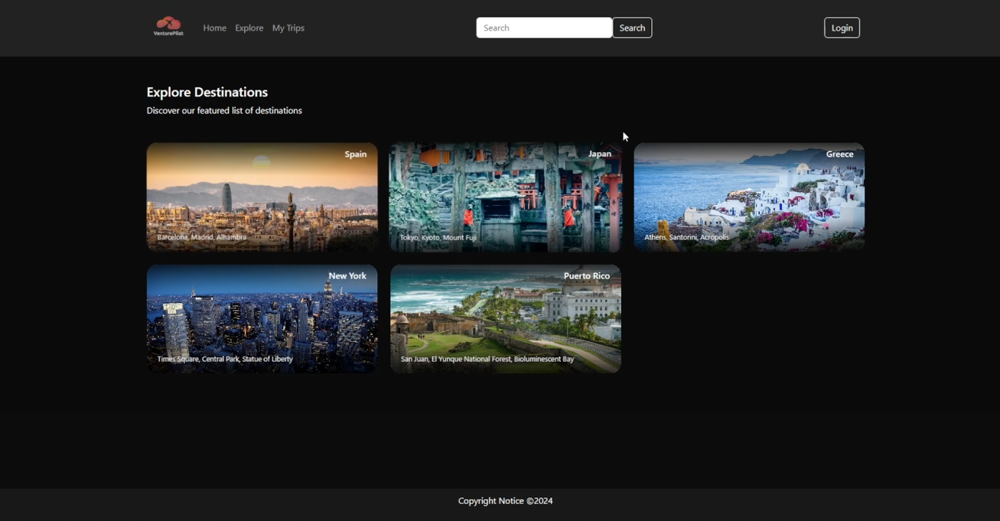
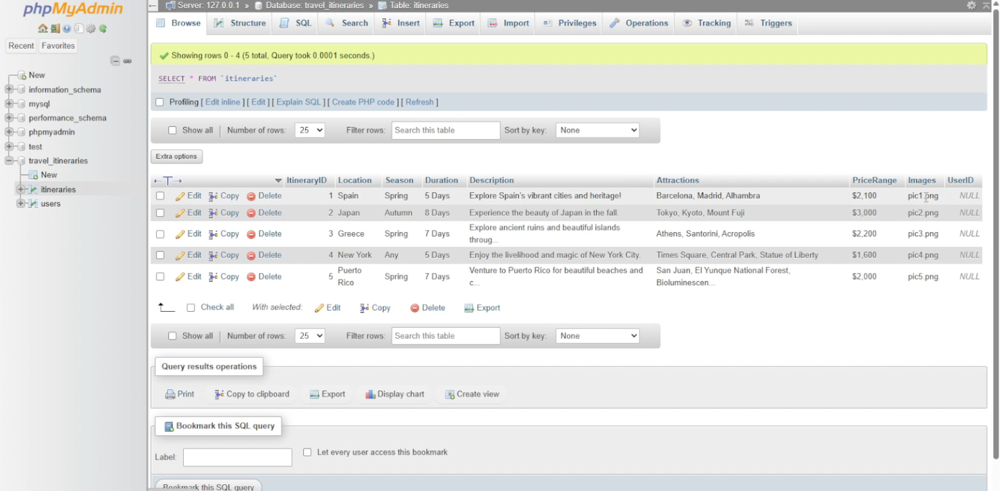

# VPTravelWebsitePortal

This is a full-stack travel website built with PHP and JavaScript. 
It features modern routing, interactive UI elements, smooth navigation, and backend server logic, showcasing web development skills in building responsive and user-friendly applications.

- Dynamic routing and page management  
- User authentication and login system  
- Interactive travel exploration pages  
- Responsive design for various devices  
- Database-driven content management  

## Screenshots

### Login Page  

### Home Page  

### Explore Page  

### Database Schema  

## How to Run

1. Clone the repository  
2. Set up your PHP environment and database (phpMyAdmin recommended)  
3. Import the database schema  
4. Configure your database connection in the project  
5. Run the project on a local server like XAMPP or WAMP  
